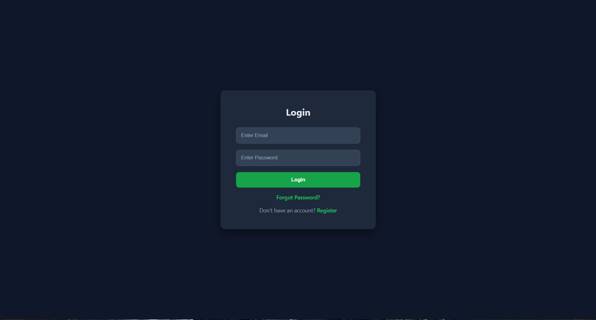
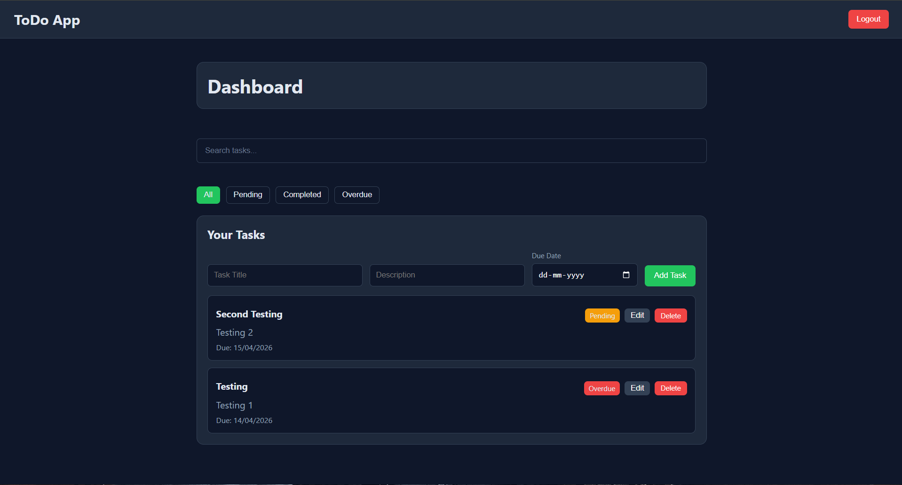
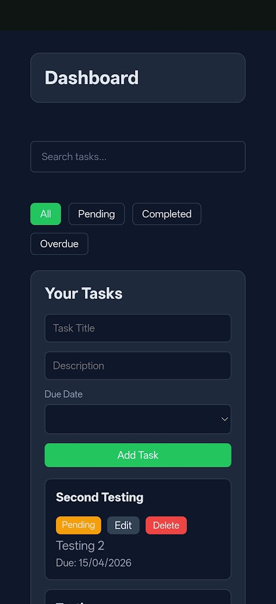

# 📝 ToDo App

A full-stack task management application where users can manage their daily tasks efficiently.

---

## 🚀 Features

- User Registration and Login (JWT Authentication)
- Create, Edit, Delete Tasks
- Task Status: Pending / Completed / Overdue
- Search and Filter Tasks
- Password Reset functionality
- Responsive UI (works on mobile and desktop)

---

## 🛠️ Tech Stack

### Frontend

- React (Vite)
- CSS

### Backend

- FastAPI
- PostgreSQL

### Deployment

- Frontend: Vercel
- Backend: Render

---

## 🌐 Live Links

Frontend: https://todo-frontend-iota-ecru.vercel.app
Backend: https://todo-backend-6b91.onrender.com

---

## ⚙️ How to Run Locally

### Backend

```bash
cd backend
pip install -r requirements.txt
uvicorn app.main:app --reload
```

### Frontend

```bash
cd frontend
npm install
npm run dev
```

---

## 🔐 Environment Variables

Create a `.env` file in backend:

```
DATABASE_URL=your_database_url
SECRET_KEY=your_secret_key
REDIS_URL=your_redis_url
```

---

---

## 📸 Screenshots

### 🔐 Login Page



### 📊 Dashboard (Desktop)



### 📱 Mobile View



## 📌 Future Improvements

- Background jobs using Celery + Redis
- Email notifications
- Better UI enhancements

---

## 👨‍💻 Author

Anjan Sairaj
